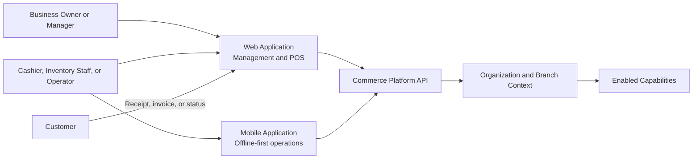
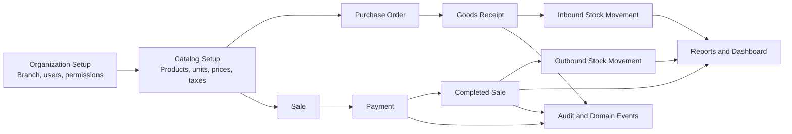
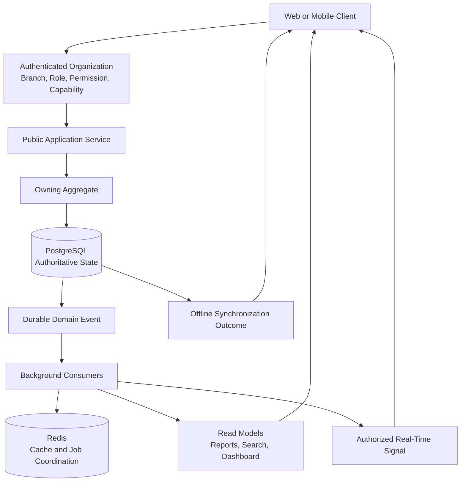
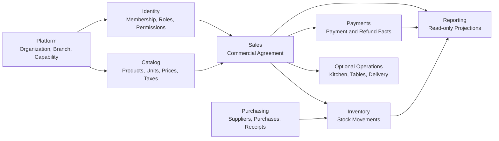
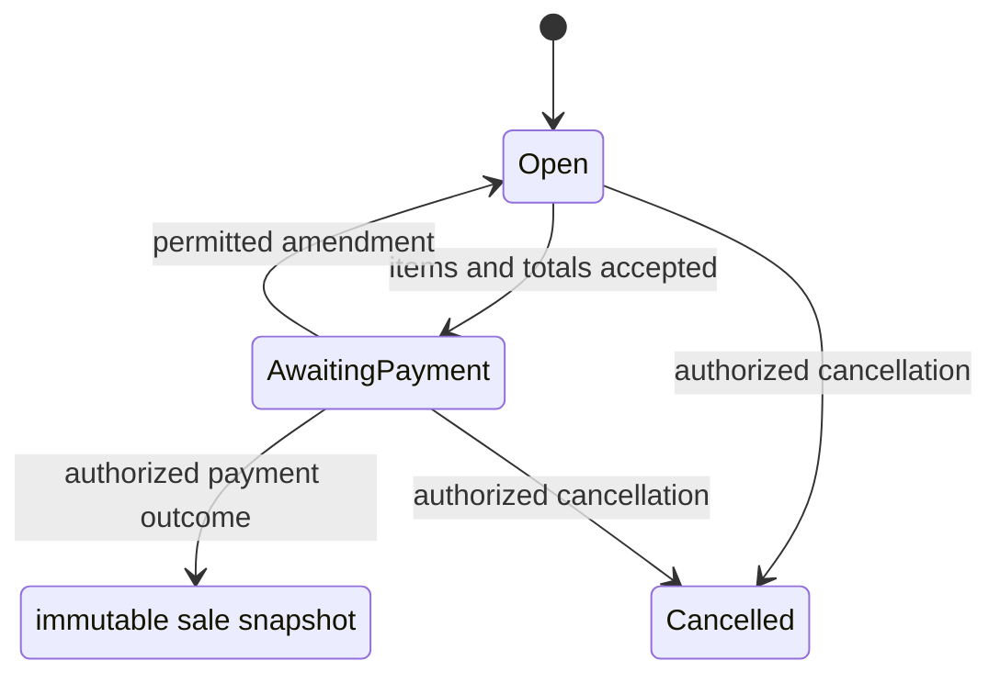
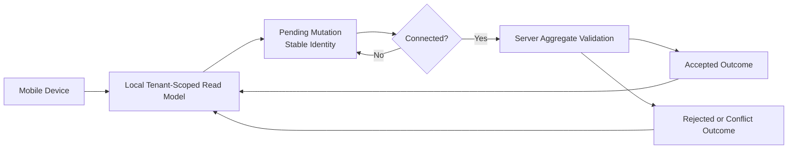
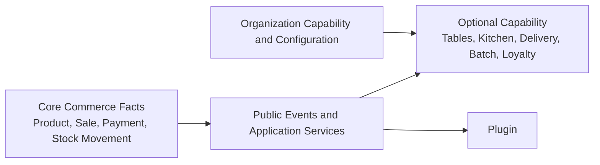

# 00. Platform System Flow

> Status: Draft
> Owner: Architecture Team
> Created: 2026-07-11
> Updated: 2026-07-11

---

# Purpose

This document shows how a business uses the Commerce Operating Platform and how each completed commerce fact flows through the platform.
The MVP is a multi-tenant commerce core. Restaurant, retail, bakery, and pharmacy workflows are added as capabilities around the same Product, Sale, Payment, and Stock Movement facts.

---

# Product View

Every action starts with an authenticated actor, Organization, Branch, permission, and enabled capability. A user interface never grants access by itself.

---

# MVP Commerce Flow

The critical decisions are:

- A Purchase does not add stock.
- A confirmed Goods Receipt adds stock through an immutable Stock Movement.
- A Sale becomes a commercial fact only when it reaches the permitted completion state.
- Payments are immutable financial facts linked to a Sale.
- A completed Sale can cause stock consumption, reporting, receipts, and future operational work.
- Reports consume completed facts and never correct them.

---

# Core System Flow

PostgreSQL is the only source of business truth. Redis improves cache and asynchronous coordination but cannot confirm a Sale, Payment, Stock Movement, permission, or offline outcome.

---

# Module Ownership Flow

Arrows represent published facts or public Application Service contracts. They do not permit one module to write another module's records.

---

# Sale and Payment Flow

Completion freezes the Sale's product, price, tax, discount, currency, Branch, and customer facts. A refund creates a linked Payment correction; it does not change the completed Sale state.

---

# Offline Flow

The device may collect permitted work offline. The server validates current permissions, tenant scope, capability state, idempotency, and Aggregate invariants before any outcome becomes authoritative.

---

# Capability Extension Flow

Optional capabilities and plugins consume public contracts. They cannot modify a completed Sale, Payment, or Stock Movement, and they cannot change the core domain model.

---

# What The MVP Looks Like

The first usable product lets a business:

1. Create an Organization, Branch, users, roles, and permissions.
2. Create Products with units, prices, taxes, and Branch availability.
3. Create a Sale and record one or more Payments.
4. Issue a receipt and retain immutable commercial and financial history.
5. Create Suppliers and Purchases, then receive stock.
6. Adjust, count, transfer, and report stock through immutable Stock Movements.
7. View tenant-scoped sales, payment, and stock reports.
8. Synchronize permitted mobile work through explicit accepted, rejected, or conflict outcomes.

---

# Architecture Rules

- Every flow is Organization-scoped; Branch scope applies where the business record is operationally local.
- PostgreSQL commits the fact before consumers update cache, reports, search, files, integrations, or real-time views.
- Completed facts are corrected through new linked facts, never destructive edits.
- The system remains one modular monolith until a capability has a proven reason to become a separate deployment boundary.
- Optional industries are capability combinations, not parallel core systems.

---

# Related Documents

- 03-module-architecture.md
- 07-offline-sync.md
- 10-multi-tenancy-architecture.md
- ../product/04-critical-business-workflows.md
- ../data/commerce-platform-mvp.dbml
- ../implementation/README.md
